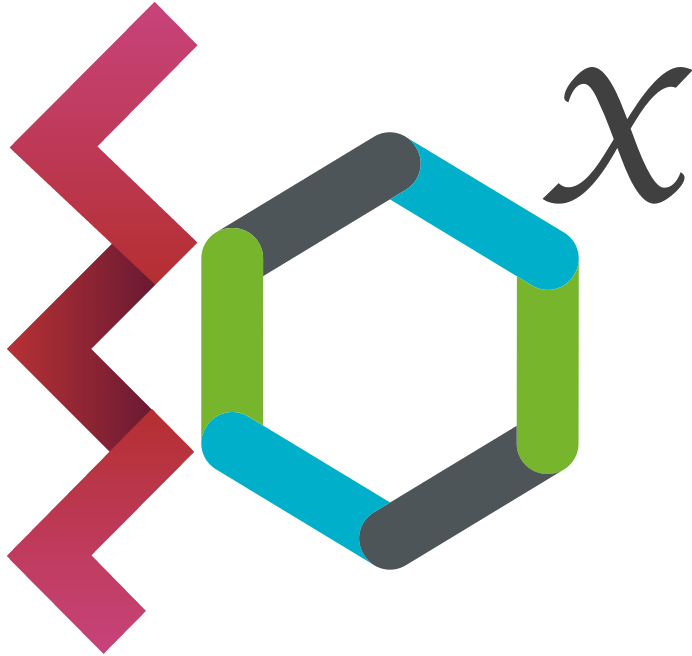

<p align="center">
  
</p>

# Dirac CWL Prototype


This Python prototype introduces a command-line interface (CLI) designed for the end-to-end execution of Common Workflow Language (CWL) workflows at different scales. It enables users to locally test CWL workflows, and then run them as jobs, transformations and/or productions.

## Prototype Workflow

### Local testing

Initially, the user tests the CWL workflow locally using `cwltool`. This step involves validating the workflow's structure and ensuring that it executes correctly with the provided inputs.

  > - CWL task: workflow structure
  > - inputs of the task

Once the workflow passes local testing, the user can choose from 3 options for submission depending on the requirements.

### Submission methods

1. **Submission as Dirac Jobs**: For simple workflows with a limited number of inputs, CWL tasks can be submitted as individual jobs. In this context, they are run locally as if they were run on distributed computing resources. Additionally, users can submit the same workflow with different sets of inputs in a single request, generating multiple jobs at once.

  > - CWL task
  > - [inputs1, inputs2, ...]
  > - Dirac description (site, priority):  Dirac-specific attributes related to scheduling
  > - Metadata (job type): Dirac-specific attributes related to scheduling + execution

2. **Submission as Dirac Transformation**: For workflows requiring continuous, real-time input data or large-scale execution, CWL tasks can be submitted as transformations. As new input data becomes available, jobs are automatically generated and executed as jobs. This method is ideal for ongoing data processing and scalable operations.

  > - CWL task (inputs already described within it)
  > - Dirac description (site, priority)
  > - Metadata (job type, group size, query parameters)

3. **Submission as Dirac Productions**: For complex workflows that require multiple steps with different requirements, CWL tasks can be submitted as productions. This method allows the workflow to be split into multiple transformations, with each transformation handling a distinct step in the process. Each transformation can manage one or more jobs, enabling large-scale, multi-step execution.

  > - CWL task (inputs already described within it)
  > - Step Metadata (per step):
  >   - Dirac description (site, priority)
  >   - Metadata (job type, group size, query parameters)

## Installation

To use this package, you first need to create a conda environment:

```bash
mamba env create -f environment.yaml
conda activate dirac-cwl
```

Then, install the package:

```bash
pip install -e .
```

## Usage

```bash
dirac-cwl job submit <workflow_path> [--parameter-path <input_path>] [--metadata-path <metadata_path>]

dirac-cwl transformation submit <workflow_path> [--metadata-path <metadata_path>]

dirac-cwl production submit <workflow_path> [--steps-metadata-path <steps_metadata_path>]
```

This package contains modules and tools to manage CWL workflows:

- `src/modules`: Python scripts for individual steps in workflows.
- `src/cli`: Utility scripts for managing and executing CWL workflows.
- `test/workflows`: CWL workflow definitions.

To use the workflows and inputs directly with `cwltool`, you need to add the `modules` directory to the `$PATH`:

```bash
export PATH=$PATH:</path/to/dirac-cwl-proto/src/dirac_cwl_proto/modules>
cwltool <workflow_path> <inputs>
```

## Contribute

### Add a workflow

To add a new workflow to the project, follow these steps:

- Create a new directory under `workflows` (e.g. `workflows/helloworld`)
- Add one or more variants of a workflow under different directory (e.g. `helloworld/helloworld_basic/description.cwl` and `helloworld/helloworld_with_inputs/description.cwl`)
- In a `type_dependencies` subdirectory, add the required files to submit a job/transformation/production from a given variant.

Directory Structure Example:

```
workflows/
└── my_new_workflow/
    |
    ├── my_new_workflow_complete/
    |   └── description.cwl
    ├── my_new_workflow_step1/
    |   └── description.cwl
    ├── my_new_workflow_step2/
    |   └── description.cwl
    |
    └── type_dependencies/
        ├── production/
        |   └── steps_metadata.yaml
        ├── transformation/
        |   └── metadata.yaml
        └── job/
            ├── inputs1.yaml
            └── inputs2.yaml
```

### Add a module

If your workflow requires calling a script, you can add this script as a module. Follow these steps to properly integrate the module:

- Add the script: Place your script in the `src/dirac_cwl_proto/modules` directory.
- Update `pyproject.toml`: Add the script to the `pyproject.toml` file to create a command-line interface (CLI) command.
- Reinstall the package: Run `pip install .` to reinstall the package and make the new script available as a command.
- Usage in CWL Workflow: Reference the command in your `description.cwl` file.

**Example**

Let’s say you have a script named `generic_command.py` located at `src/dirac_cwl_proto/modules/generic_command.py`. Here's how you can integrate it:

- `generic_command.py` Example Script:

```python
#!/usr/bin/env python3
import typer
from rich.console import Console

app = typer.Typer()
console = Console()

@app.command()
def run_example():
    console.print("This is an example command.")

if __name__ == "__main__":
    app()
```

- Update `pyproject.toml`:

```toml
[project.scripts]
generic-command = "dirac_cwl_proto.modules.generic_command:app"
```

- Reinstall the package with `pip install .`:
- Reference in description.cwl:

```yaml
baseCommand: [generic-command]
```

### Test your changes

- Add your test in `test/test_workflows`.
- Run `pytest`:

```bash
pytest test/test_workflows.py
```
